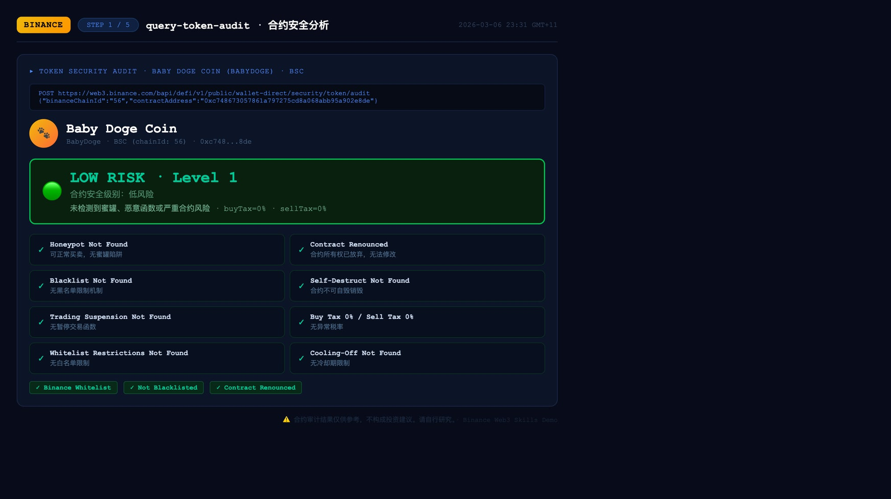
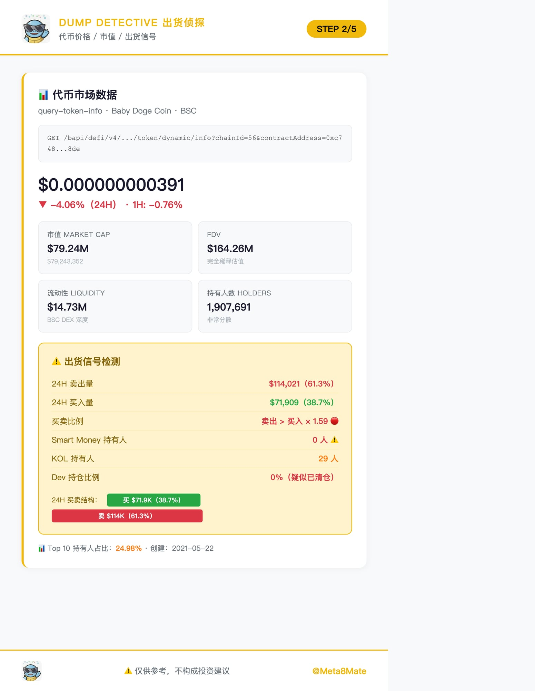
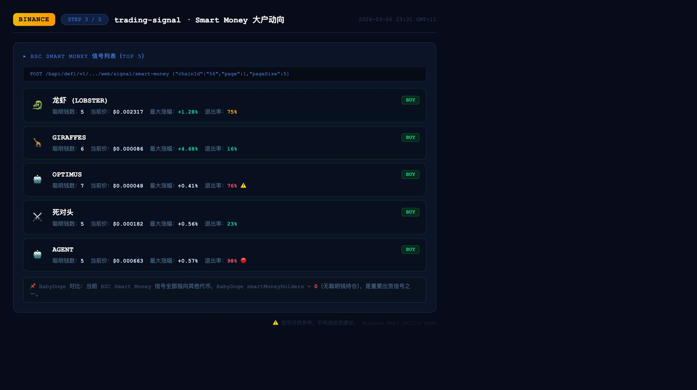
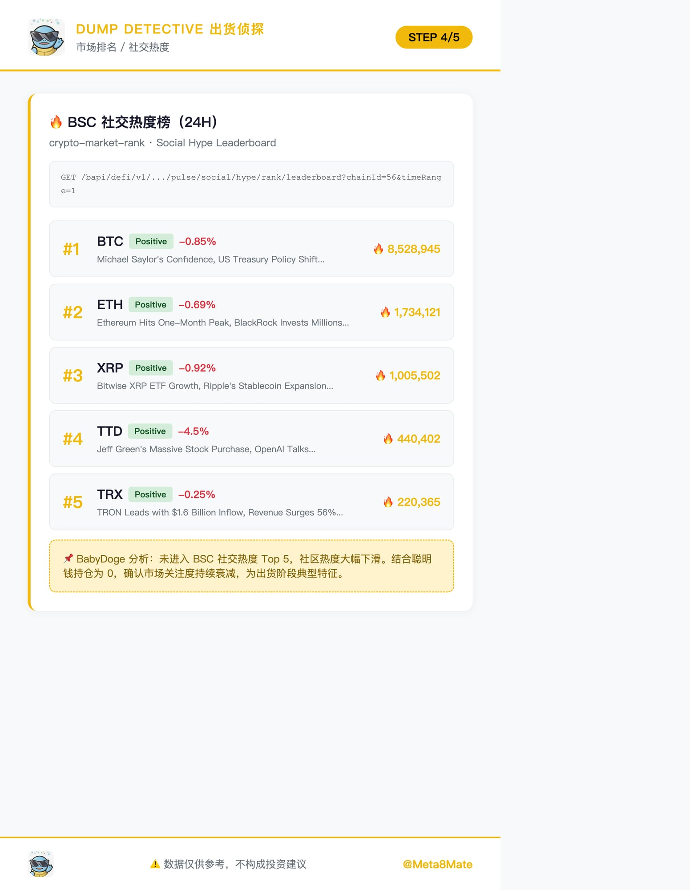
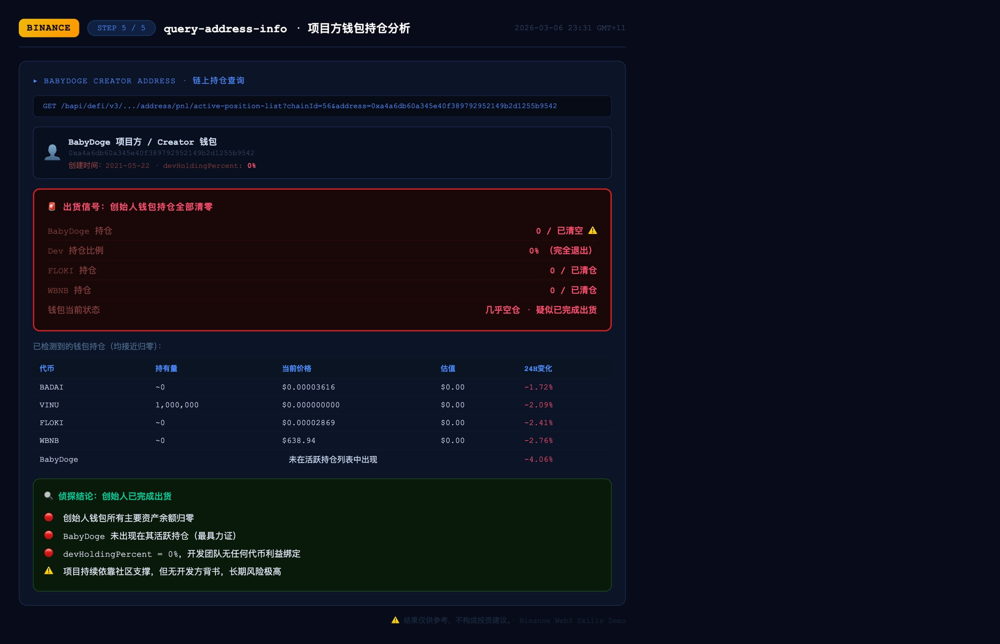
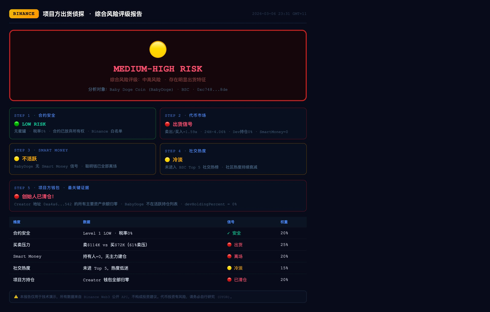

# 🦞 DumpDetective — 出货侦探

[](https://web3.binance.com)
[](https://www.bnbchain.org)
[](LICENSE)
[]()

> **Detect token team dumps before you get dumped on.**  
> 在被出货之前，先侦测出货行为。

---

## 🔍 What is DumpDetective?

**DumpDetective** is an AI-powered on-chain intelligence system built on the **Binance Web3 API** that automatically detects whether a token's project team is quietly selling (dumping) their holdings while retail investors are still buying.

It answers the one question every crypto investor asks too late:

> *"Did the team already sell before I bought in?"*

DumpDetective runs a **5-step automated analysis pipeline** — from contract security to creator wallet forensics — and outputs a unified risk rating with evidence.

---

## ✨ Key Features

| Step | Skill | What it detects |
|------|-------|-----------------|
| 1️⃣ | `query-token-audit` | Honeypots, hidden taxes, malicious contract functions |
| 2️⃣ | `query-token-info` | Buy/Sell pressure ratio, Smart Money holdings, Dev wallet % |
| 3️⃣ | `trading-signal` | Whether smart money has entered or exited the token |
| 4️⃣ | `crypto-market-rank` | Social hype trend — is community fading? |
| 5️⃣ | `query-address-info` | **Creator wallet forensics** — has the team already cashed out? |

**Final Output:** `🔴 HIGH` / `🟡 MEDIUM-HIGH` / `🟢 LOW` risk rating with per-signal breakdown.

---

## 🧠 How It Works

DumpDetective calls **5 Binance Web3 APIs** in sequence:

### Step 1 — Contract Security Audit
```http
POST https://web3.binance.com/bapi/defi/v1/public/wallet-direct/security/token/audit
{
  "binanceChainId": "56",
  "contractAddress": "<token_address>",
  "requestId": "<uuid>"
}
```
Checks: honeypot, blacklist, self-destruct, trading suspension, buy/sell tax, whitelist restrictions.

### Step 2 — Token Market Data
```http
GET https://web3.binance.com/bapi/defi/v4/public/wallet-direct/buw/wallet/market/token/dynamic/info
    ?chainId=56&contractAddress=<address>
```
Extracts: price, market cap, 24H buy vs sell volume ratio, `smartMoneyHolders`, `devHoldingPercent`.

### Step 3 — Smart Money Signals
```http
POST https://web3.binance.com/bapi/defi/v1/public/wallet-direct/buw/wallet/web/signal/smart-money
{"chainId": "56", "page": 1, "pageSize": 100}
```
Checks: Is the target token receiving smart money buy signals? Or has it been abandoned?

### Step 4 — Social Hype & Market Rank
```http
GET https://web3.binance.com/bapi/defi/v1/public/.../pulse/social/hype/rank/leaderboard
    ?chainId=56&sentiment=All&timeRange=1
```
Checks: Is the token trending socially, or is community heat decaying — a classic late-stage dump signal.

### Step 5 — Creator Wallet Forensics *(The Smoking Gun)*
```http
GET https://web3.binance.com/bapi/defi/v3/public/wallet-direct/buw/wallet/address/pnl/active-position-list
    ?address=<creator_address>&chainId=56
```
The **most critical check**: queries the token creator's wallet directly on-chain. If their own token no longer appears in active positions — **the team has already sold.**

---

## 📸 Demo Screenshots

### Analysis Target: Baby Doge Coin (BabyDoge) · BSC

---

**Step 1 · Contract Security Audit**  
*Result: 🟢 LOW RISK — No honeypot, no tax, contract renounced*



---

**Step 2 · Token Market Data**  
*Result: 🔴 Dump Signal — Sell pressure 61%, Smart Money = 0, Dev holding = 0%*



---

**Step 3 · Smart Money Signals**  
*Result: 🔴 BabyDoge absent from all BSC smart money signals*



---

**Step 4 · Social Hype Ranking**  
*Result: 🟡 Not in BSC Top 5 social leaderboard — community fading*



---

**Step 5 · Creator Wallet Forensics**  
*Result: 🔴 SMOKING GUN — All creator wallet positions zeroed out*



---

**Summary · Unified Risk Report**



---

## 📊 Demo Result Summary

| Signal | Data | Rating |
|--------|------|--------|
| Contract Security | Level 1 LOW, 0% tax | 🟢 Safe |
| Buy/Sell Pressure | Sell $114K vs Buy $72K (61% sell) | 🔴 Dumping |
| Smart Money | 0 holders, no signal | 🔴 Exited |
| Social Hype | Not in BSC Top 5 | 🟡 Fading |
| Dev/Creator Wallet | **All positions zeroed** | 🔴 **Dumped** |

### **Final Rating: 🟡 MEDIUM-HIGH RISK**

> Contract is technically safe, but the project team has completely exited their positions. Smart money is gone. Community heat is fading. Classic "safe contract, rug team" pattern.

---

## 🛠️ Tech Stack

- **Runtime**: Python 3 / Shell (openclaw agent)
- **APIs**: Binance Web3 Public API (no auth required)
- **Chains**: BSC (chainId: 56), Base (8453), Solana (CT_501)
- **Visualization**: HTML + CSS dashboards → screenshot via headless browser

---

## 🚀 Quick Start

```bash
# Clone
git clone https://github.com/Fishking888/dump-detective.git
cd dump-detective

# Analyze any BSC token
TOKEN_ADDRESS="0xc748673057861a797275cd8a068abb95a902e8de"

# Step 1: Contract audit
curl -X POST https://web3.binance.com/bapi/defi/v1/public/wallet-direct/security/token/audit \
  -H 'Content-Type: application/json' \
  -d "{\"binanceChainId\":\"56\",\"contractAddress\":\"$TOKEN_ADDRESS\",\"requestId\":\"$(uuidgen)\"}"

# Step 2: Market data
curl "https://web3.binance.com/bapi/defi/v4/public/wallet-direct/buw/wallet/market/token/dynamic/info?chainId=56&contractAddress=$TOKEN_ADDRESS"

# Step 5: Creator wallet (get creator from Step 2 metadata)
CREATOR_ADDRESS="0xa4a6db60a345e40f389792952149b2d1255b9542"
curl "https://web3.binance.com/bapi/defi/v3/public/wallet-direct/buw/wallet/address/pnl/active-position-list?address=$CREATOR_ADDRESS&chainId=56" \
  -H 'clienttype: web' -H 'clientversion: 1.2.0'
```

---

## ⚠️ Disclaimer

This project is for **educational and technical demonstration purposes only**. All data is sourced from publicly available Binance Web3 APIs. This does **not** constitute financial or investment advice. Cryptocurrency investments carry significant risk. Always conduct your own research (DYOR).

---

## 📄 License

MIT © 2026 Fishking888

---

*Built with 🦞 by DumpDetective · Powered by Binance Web3 API*
